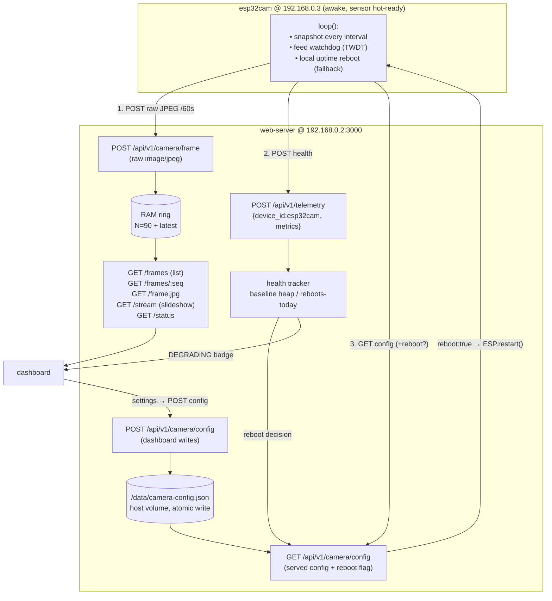

# ESP32-CAM Longevity Redesign (v2)

Design for the second-generation `web-server` ↔ `esp32cam` integration. Supersedes
the v1 protocol in [`camera-protocol.md`](./camera-protocol.md).

> **Status:** implemented (issues #1–#6) on branch `feat/pump-zone-esp01`.
> Server + client changes are runtime-verified; the ESP32-CAM firmware compiles
> against the described APIs but is **not yet hardware-tested** — flash and bench
> it before trusting the reboot/watchdog paths.

## 1. Motivation & what changed from v1

The stated goal was "long-term operation and power consumption," and the initial
idea was **deep sleep**. Grilling the plan changed the foundation:

- **The board is mains/USB-powered.** Power is *not* a constraint, so deep sleep
  buys nothing it would on a battery — and it would *cost* live streaming, OTA,
  and add reboot churn. **Deep sleep is rejected.**
- **The real driver is _preventive_ longevity + crash-resilience** — the AI-Thinker
  ESP32-CAM runs hot at continuous UXGA streaming and is known to lock up after
  long uptimes. No failure has been observed yet; this is precautionary.

So v2 is a **duty-cycle + reliability** redesign, not a power redesign:

| Concern | v1 | v2 |
|---|---|---|
| Camera runtime | awake, continuous `:81` MJPEG stream | awake, **sensor idle between snapshots** (no continuous stream) |
| Snapshot cadence | push every 10 s (+ live pull proxy) | push every **60 s** (configurable) |
| Live view | real live via `/live` pull proxy | **slideshow only** (latest snapshot); `/live` **retired** |
| Server storage | single latest frame | **RAM ring of N=90 frames** + latest |
| Camera config | compile-time (`secrets.h`) | **pulled from server** each cycle (host-mounted JSON) |
| Health visibility | none ("not yet reported") | camera reports heap/RSSI/uptime via `/api/v1/telemetry` |
| Reboot / recovery | none | **watchdog + local fallback + server-driven health reboot** |

### Rejected / out of scope (deliberate)

- **Deep sleep** — wrong tool for a mains node; kills live + OTA.
- **Full `esp_camera_deinit()` between shots** — marginal extra cooling, but a known
  ESP32-CAM flakiness source; keeping the sensor initialized is more reliable and
  the goal is reliability. (Thermal win comes from *not streaming*, not from
  powering the sensor down.)
- **On-demand real live** (spin the `:81` stream up only while someone watches) —
  architecturally left open by keeping the sensor hot-ready, but not built in v1.
- **Durable on-disk frame history** — declined; frames stay in RAM (lose-on-restart
  is acceptable). Only *config* is persisted to disk.

## 2. Decisions summary

| # | Decision |
|---|---|
| 1 | Mains-powered → **no deep sleep** |
| 2 | Driver = **preventive** longevity/heat + crash-resilience |
| 3 | Camera **stays awake**, sensor **kept initialized**, **no continuous stream** |
| 4 | Snapshot **interval default 60 s**, configurable |
| 5 | Camera **keeps its `:80` server**; `:81` continuous stream dropped |
| 6 | **Live = slideshow** (`/stream` relay of pushed frames); **`/live` + `cameraLive.js` retired** |
| 7 | Server keeps a **RAM ring, N=90 default**, lose-on-restart OK |
| 8 | Config delivered by **pull**: camera `GET /config` each cycle |
| 9 | "Online" is **implicit from frame age** (no separate handshake) |
| 10 | Camera reports **health via `/api/v1/telemetry`** as `device_id:"esp32cam"` |
| 11 | Config fields: `snapshot_interval_ms`, `framesize`, `jpeg_quality`, `enabled`, `reboot_interval_hours` |
| 12 | Config **persisted to a host-mounted JSON file**, atomic write |
| 13 | Reboot = **watchdog** + **local uptime fallback** + **server-driven health reboot** |
| 14 | Heap reboot = **trend-relative (<50% of post-boot baseline)**, guarded |
| 15 | Guards: **uptime > 1 h**, **≤3 reboots/day → then DEGRADING alert** instead |
| 16 | Stale threshold = **2.5× snapshot interval** (derived, replaces hardcoded 15 s) |
| 17 | History UI = **timeline scrubber** over the ring; monotonic-seq frame API |
| 18 | Session `RecentCaptures` gallery **retired**; one server-backed history |
| 19 | Manual "Capture" button **dropped**; keep **"Download current frame"** |
| 20 | DEGRADING alert = **dashboard badge in v1**; notification is a fast-follow |

## 3. Architecture



## 4. Camera firmware (v2)

`setup()`: init camera (kept initialized for the whole run), connect WiFi, start
`:80` control server, start OTA, **enable Task Watchdog (TWDT)**.

`loop()` each pass:
1. **Feed the watchdog.**
2. If `enabled` and `now - lastSnapshot ≥ snapshot_interval_ms`:
   - grab one validated JPEG (sensor is already initialized — no re-init),
   - `POST /api/v1/camera/frame` (raw `image/jpeg`, as today),
   - `POST /api/v1/telemetry` with `{ free_heap, rssi, uptime_s, fw_version }`,
   - `GET /api/v1/camera/config`, apply any deltas (interval, framesize, quality, enabled),
   - if the response has `reboot:true` → `ESP.restart()` (fires **after** the push, never mid-frame).
3. **Local fallback reboot:** if `reboot_interval_hours > 0` and uptime exceeds it →
   `ESP.restart()` (covers "server unreachable, can't be told to reboot").
4. WiFi auto-reconnect check (as today).

**Three reliability layers** (each covers a different failure):

| Layer | Where | Covers |
|---|---|---|
| Task watchdog (TWDT) | camera | acute hangs — the loop stopped running |
| Local uptime reboot | camera | server unreachable / can't deliver a reboot |
| Server-driven reboot | server → config | slow degradation (heap leak), scheduled quiet-hour |

> **Note:** the `:81` continuous stream server is **removed**. `:80` (index UI,
> `/capture`, `/control`, `/status`) stays for OTA-era debugging and on-demand grab.

## 5. Server: endpoints

### New
| Endpoint | Purpose |
|---|---|
| `GET /api/v1/camera/config` | Serve stored config **plus** the computed `reboot` flag for this camera |
| `POST /api/v1/camera/config` | Dashboard writes config → validate → atomic write to JSON file |
| `GET /api/v1/camera/frames` | List ring metadata: `[{ seq, receivedAt, bytes }]` |
| `GET /api/v1/camera/frames/:seq` | One JPEG by monotonic seq id (`404` if evicted) |

### Changed
| Endpoint | Change |
|---|---|
| `POST /api/v1/camera/frame` | Also **appends to the RAM ring** (assigns `seq`), not just the latest slot |
| `GET /api/v1/camera/status` | `online` uses **stale = 2.5× interval**, not the fixed 15 s; add `degrading` flag |
| `POST /api/v1/telemetry` | Now also receives camera health; feeds the health tracker (baseline heap, reboot decision) |

### Retired
| Endpoint | Reason |
|---|---|
| `GET /api/v1/camera/live` + `store/cameraLive.js` | Camera no longer streams continuously; slideshow via `/stream` replaces it |

### `frameStore` change
Generalize the single-slot buffer (`store/frameStore.js`) into an **N-frame ring**:
`push(buf)` assigns a monotonic `seq`, appends, evicts oldest when `size > N`, keeps
`latest` for `/frame.jpg` + `/stream`, still notifies slideshow subscribers. Memory
is bounded: at SVGA (~40 KB) × 90 ≈ **~4 MB**.

## 6. Config

### Stored file — `/data/camera-config.json` (host volume, atomic write)
```json
{
  "snapshot_interval_ms": 60000,
  "framesize": "SVGA",
  "jpeg_quality": 12,
  "enabled": true,
  "reboot_interval_hours": 24
}
```
- Defaults seeded from env (`CAMERA_SNAPSHOT_INTERVAL_MS`, `CAMERA_RING_SIZE`, …) on
  first run if the file is absent.
- Written only when the dashboard changes a setting (rare → no SD-wear concern),
  via **temp file + `rename`** so the camera never reads a torn file.
- `docker-compose.yaml`: mount `./data:/data`, set `CAMERA_CONFIG_PATH=/data/camera-config.json`.

### Served response — `GET /config`
Stored config **plus** the transient, server-computed reboot decision:
```json
{ "...stored fields...": "...", "reboot": false }
```

### Validation (on `POST /config`)
`snapshot_interval_ms` 5000–3600000 · `jpeg_quality` 4–63 · `framesize` ∈ sensor enum ·
`reboot_interval_hours` 0–168 · ring `N` ≥ 1. LAN/WPA2 is the only gate (no auth,
consistent with the rest of the system).

## 7. Health telemetry & reboot decision

Camera → `POST /api/v1/telemetry` each cycle:
```json
{ "device_id": "esp32cam",
  "metrics": { "free_heap": 123456, "rssi": -62, "uptime_s": 3600, "fw_version": "2.0.0" } }
```
Server stamps the timestamp; the frame appears as a normal **device card**
(hardware-agnostic principle — no new UI infra needed).

Per-camera health state the server tracks:
- `baseline_heap` — first `free_heap` after a boot (detected when `uptime_s` resets low)
- `reboots_today` — reset at RTC local midnight (Jetson has a real clock)
- `last_reboot_at`, `degrading`

**Reboot decision** (evaluated when `/config` is pulled):
```
if reboots_today >= 3:      degrading = true;  reboot = false   # escape hatch → alert, don't loop
elif uptime_s < 3600:       reboot = false                      # min-uptime guard (anti-flap)
elif free_heap < 0.5 * baseline_heap:  reboot = true            # trend trigger (leak)
else:                       reboot = false
```
Optional secondary (cheap, RTC available): also `reboot = true` once per day at a
quiet hour (e.g. 03:00) — a scheduled clean reboot in addition to the leak trigger.

This is the payoff of the whole redesign: the board is rebooted **on evidence of
degradation**, before it locks up — and can never enter a reboot loop.

## 8. Client (dashboard) changes

- **Live viewport** → the slideshow `GET /api/v1/camera/stream` (already same-origin).
  Remove the `/live` fallback wiring (`RELAY_LIVE_URL`) and the `cameraLive` path.
- **History** → new **timeline scrubber** over `GET /frames` (+ thin thumbnail strip),
  fetching `GET /frames/:seq` for the selected frame. **Replaces** the client-session
  `RecentCaptures` gallery (`CamerasPage.jsx:166`) — one server-backed history.
- **Manual "Capture Image"** → **removed**; keep **"Download current frame"** (saves
  the latest ring frame locally).
- **Node Metrics** → fill in the real fields the UI currently stubs
  (`CamerasPage.jsx:159` "RSSI / CPU temp / FPS not yet reported") from the esp32cam
  telemetry: RSSI, free heap, uptime, fw version.
- **DEGRADING badge** → red state on the camera health card + Cameras page when the
  server sets `degrading`. (Active notification = fast-follow, not v1.)
- **Settings** → a Camera Control panel that `POST`s the config fields (interval,
  framesize, quality, enabled, reboot interval). Distinct from the existing
  browser-display `cameraSettings.js` (localStorage) — keep the two scopes separate.

## 9. Deployment

- `docker-compose.yaml`: add `volumes: - ./data:/data`; add env
  `CAMERA_CONFIG_PATH`, `CAMERA_SNAPSHOT_INTERVAL_MS`, `CAMERA_RING_SIZE`,
  `CAMERA_STALE_FACTOR` (2.5), heap-reboot params.
- Firmware `secrets.h`: `PUSH_URL` stays `…/api/v1/camera/frame`; add the telemetry
  and config URLs (or derive from a single host:port). Keep WiFi/OTA creds local.
- **OTA still works** (camera stays awake) — no maintenance window needed, unlike the
  deep-sleep design would have required.

## 10. Open items — resolution

- `framesize` remote-set: **applied live** via `sensor_t::set_framesize` in
  `fetchConfig()` (no reboot required).
- Daily quiet-hour reboot: **not shipped** in v1 — the heap-trend health reboot
  ships instead (server-side `cameraHealth.js`); the quiet-hour trigger is a
  documented fast-follow (add a wall-clock branch to `shouldReboot`).
- Scrubber polls `/frames` every **5 s** (`FRAMES_POLL_MS`).
- Ring RAM ceiling: **implemented** — `POST /config` rejects
  `ring_size × CAMERA_MAX_FRAME_BYTES` over `CAMERA_RING_RAM_BUDGET_BYTES`
  (default 256 MB).

## 11. Firmware bring-up caveats (not yet hardware-tested)

- The camera now depends on **ArduinoJson** (`platformio.ini` `lib_deps`) — first
  `pio run` pulls it.
- `secrets.h` needs the new keys (`DEVICE_ID`, `FW_VERSION`, `TELEMETRY_URL`,
  `CONFIG_URL`); `#ifndef` guards keep an older file compiling but with telemetry/
  config disabled. See `secrets.example.h`.
- The **task watchdog** is armed at 30 s and fed once per `loop()`. The push cycle
  (capture + two POSTs + config GET) must stay well under 30 s; HTTPClient's 5 s
  per-op timeout keeps worst case ~15 s. Bench-verify before trusting it.
- Server-commanded reboot and the local uptime fallback both call `ESP.restart()`;
  confirm the board re-associates + re-leases DHCP cleanly on your AP.
