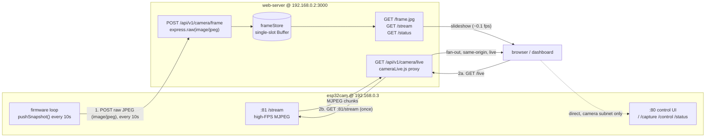

# Camera Protocol — `web-server` ↔ `esp32cam`

How the Node web-server and the AI-Thinker ESP32-CAM firmware talk to each other.

There are **two independent paths**, running in **opposite directions**:

1. **PUSH** — the camera is the HTTP *client* and POSTs a full-res JPEG snapshot
   every ~10 s to the server (low-bandwidth persistence / fallback slideshow).
2. **PULL / live proxy** — the server is the HTTP *client* and pulls the camera's
   own high-FPS MJPEG stream once, then fans it out same-origin to every browser
   (real-time video).

## Network topology (this deployment)

Both devices sit on the `MJU-SmartFarm-AP-II` Wi-Fi (WPA2), served by `ap-server`
(`192.168.0.1`).

| Node        | Address              | Listens on                                   |
|-------------|----------------------|----------------------------------------------|
| `ap-server` | `192.168.0.1`        | SoftAP + DHCP (MAC→IP reservation for cam)   |
| `esp32cam`  | `192.168.0.3` (DHCP-reserved) | `:80` control UI + `:81` MJPEG stream |
| `web-server`| `192.168.0.2:3000`   | `/api/v1/camera/*` (Node/Express, on Jetson) |

## Diagram

## Path 1 — PUSH (camera → server)

The camera acts as the HTTP **client**.

| Aspect            | Value                                                                 |
|-------------------|-----------------------------------------------------------------------|
| Direction         | `esp32cam` → `web-server`                                              |
| Camera code       | `pushSnapshot()` — `esp32cam/src/main.cpp:237` (gated by `PUSH_ENABLED 1`) |
| Trigger           | Every `PUSH_INTERVAL_MS` = **10 000 ms** (`main.cpp:320`)              |
| Request           | `POST http://192.168.0.2:3000/api/v1/camera/frame`                    |
| Content-Type      | `image/jpeg`                                                           |
| Body              | Raw JPEG bytes (validated SOI/EOI frame) — **not** multipart or base64 |
| Server handler    | `web-server/src/routes/camera.js:18` — `express.raw({ limit: 2 MB })` |
| Success response  | `202 { bytes, receivedAt }`                                           |
| Error response    | `400` on empty/non-buffer body                                        |
| Storage           | `web-server/src/store/frameStore.js` — single in-memory Buffer, overwritten each push (no SD write on the Jetson) |

**Downstream endpoints** the server derives from the pushed frame:

| Endpoint                          | Purpose                                                        |
|-----------------------------------|----------------------------------------------------------------|
| `GET /api/v1/camera/frame.jpg`    | Latest snapshot (`503` if none yet). `Cache-Control: no-store` |
| `GET /api/v1/camera/stream`       | Re-broadcasts pushed frames as MJPEG (`multipart/x-mixed-replace`, boundary `smartfarmframe`) |
| `GET /api/v1/camera/status`       | `{ online, hasFrame, ageMs, bytes, receivedAt, clients }` — `online` if age ≤ `CAMERA_STALE_MS` (15 s) |

> ⚠️ Because pushes are ~1 frame / 10 s, this path is a **slideshow**, not live
> video. It exists as a low-bandwidth, always-on latest-frame slot (and optional
> AI-feed source), independent of whether anyone is watching.

## Path 2 — PULL / live proxy (server → camera)

The web-server acts as the HTTP **client**, pulling the camera's own stream.

| Aspect            | Value                                                                 |
|-------------------|-----------------------------------------------------------------------|
| Direction         | `web-server` → `esp32cam:81`                                           |
| Server code       | `web-server/src/store/cameraLive.js`                                   |
| Upstream request  | `GET http://192.168.0.3:81/stream` (env `CAMERA_STREAM_URL`)          |
| Camera handler    | `stream_handler()` — `esp32cam/src/app_httpd.cpp:185`, boundary `123456789000000000000987654321` |
| Client entrypoint | `GET /api/v1/camera/live` — `camera.js:70`                            |
| Behavior          | Server opens **one** upstream connection and multiplexes chunks to all viewers same-origin; auto-reconnects after `CAMERA_LIVE_RECONNECT_MS` (3 s) on transient drops; ends viewers → "NO SIGNAL" on hard-down; stops pulling when the last viewer leaves |

**Why both paths exist:** the camera's `:81` stream is only reachable from the
camera's own Wi-Fi subnet and has a very small concurrent-connection limit. The
proxy lets the Jetson (which *is* on that subnet) pull once and re-serve live
video to any client that can load the dashboard, while the camera only ever sees
a single connection.

## Camera's own HTTP surface (`:80`/`:81`, not called by web-server)

Endpoints the camera serves for its standalone web UI. A browser on the camera
subnet can hit these directly; the Node server does **not** (except `:81/stream`
via the live proxy above). All send `Access-Control-Allow-Origin: *`.

| Endpoint                          | Purpose                                             |
|-----------------------------------|-----------------------------------------------------|
| `GET :80/`                        | Control UI (HTML)                                   |
| `GET :80/capture`                 | One validated JPEG on demand                        |
| `GET :80/control?var=<name>&val=<int>` | Live sensor tweaks (framesize, quality, brightness, contrast, saturation, hmirror, vflip, led_intensity) |
| `GET :80/status`                  | Current sensor state as JSON                        |
| `GET :81/stream`                  | High-FPS MJPEG (source for the live proxy)          |

## Capture configuration

`initCamera()` — `esp32cam/src/main.cpp:28`:

- `FRAMESIZE_UXGA` (1600×1200), JPEG quality 12, double-buffered in PSRAM
- 10 MHz XCLK for clean DMA captures (tuned for a clean AI still, not FPS)

This is why individual frames can approach the server's 2 MB
`CAMERA_MAX_FRAME_BYTES` cap.

## Tunables

| Where       | Setting                     | Default                              |
|-------------|-----------------------------|--------------------------------------|
| Camera      | `PUSH_ENABLED`              | `1` (`include/secrets.h`)            |
| Camera      | `PUSH_URL`                  | `http://192.168.0.2:3000/api/v1/camera/frame` |
| Camera      | `PUSH_INTERVAL_MS`          | `10000`                              |
| Server      | `CAMERA_MAX_FRAME_BYTES`    | `2 * 1024 * 1024` (2 MB)             |
| Server      | `CAMERA_STALE_MS`           | `15000`                              |
| Server      | `CAMERA_STREAM_URL`         | `http://192.168.0.3:81/stream`       |
| Server      | `CAMERA_LIVE_RECONNECT_MS`  | `3000`                               |
| Server      | `CAMERA_LIVE_TIMEOUT_MS`    | `10000`                              |
